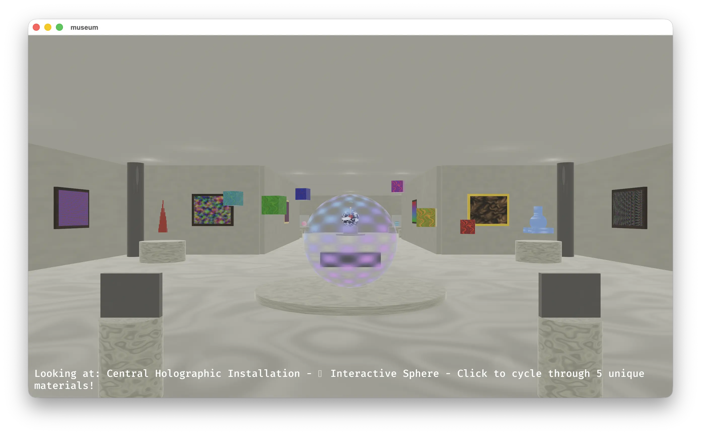

# diorama



> ⚠️ This project is experimental and shared as-is.
> Expect rough edges, vibe-coded logic, and unreviewed code — use at your own risk!

A Bevy plugin that provides core functionality like a first person controller and setting up physics, along with a few examples using it.

## Controls

| Keys   | Description                | Features Required |
| ------ | -------------------------- | ----------------- |
| WASD   | Movement                   | -                 |
| LShift | Sprint                     | -                 |
| F3+G   | Toggle geometry wireframes | -                 |
| F3+B   | Toggle collider wireframes | `dev`             |
| F7     | Toggle world inspector     | `dev`             |
| F8     | Toggle performance UI      | `dev`             |

## Examples

Running with [just](https://github.com/casey/just) sets the correct `BEVY_ASSET_DIR` for each example.

```shell
just run <example>
just run <example> --features dev
```

- [simple](examples/simple/) - minimal scene with just a plane and a cube
- [platformer](examples/platformer/) - 3D platformer
- [museum](examples/museum/) - generated shaders, complex geometry and dialogue
